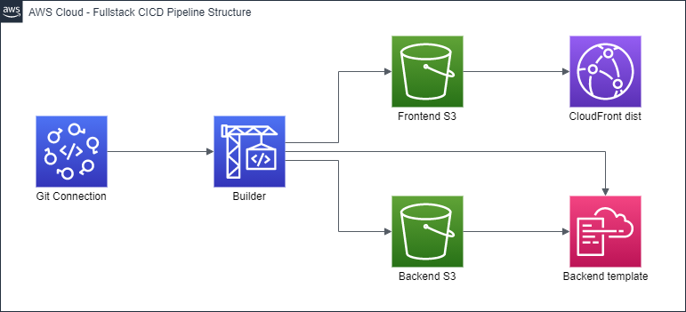

# CodePipeline fullstack CICD pipeline

This is a [CloudFormation](https://aws.amazon.com/cloudformation/) template that creates a [CodePipeline](https://aws.amazon.com/codepipeline/) pipeline that builds and deploys [fullstack applications](https://github.com/Channeas/cicd-fullstack-test) on AWS. It builds git projects, that are fetched using a [CodeStar Connection](https://docs.aws.amazon.com/dtconsole/latest/userguide/connections.html). The frontend is deployed on a [CloudFront](https://aws.amazon.com/cloudfront/) distribution.

## Setup

To run this template, your project should be organized like the [example repository](https://github.com/Channeas/cicd-fullstack-test). This means that there needs to be 2 root folders, named frontend and backend. Both those folders should contain their own [CodeBuild builspec](https://docs.aws.amazon.com/codebuild/latest/userguide/build-spec-ref.html). Please see the [example repository](https://github.com/Channeas/cicd-fullstack-test) to see how these should be structured. The backend folder should also contain a [CloudFormation template](https://aws.amazon.com/cloudformation/resources/templates/) named template.yml that describes your backend.

Besides the above project structure, there are 4 prerequisites you need before running this template:

-   A [CodeStar Connection](https://docs.aws.amazon.com/dtconsole/latest/userguide/connections.html) to the git provider where your project is hosted. You can find existing connections under [Developer Tools](https://aws.amazon.com/products/developer-tools/) > Settings > Connections
-   A domain for serving the frontend, as well as an [ACM](https://aws.amazon.com/certificate-manager/) SSL certificate for that domain
-   A CloudFormation template hosted on [S3](https://aws.amazon.com/s3/) that will be used for building the initial backend. The [empty stack template](empty-stack.yml) in this repository is recommended
-   An [SNS](https://aws.amazon.com/sns/) topic that will be used for sending notifications regarding manual approval of the backend

Once these 4 things are dealt with, run the template either in the [CloudFormation](https://aws.amazon.com/cloudformation/) console, or using the [AWS CLI](https://aws.amazon.com/cli/). The parameters required by the template are explained below.

After the template has finished building all the resources, you will need to point your domain to the CloudFront distribution. You will find the url to point to in the outputs section of the template. The url will be under the label _CloudFrontURL_. How you point will depend on what DNS provider you are using. If you are using [Route 53](https://aws.amazon.com/route53/), create an A record. If you are using another DNS provider, create a CNAME record instead. For more details, see [the official documentation](<https://docs.aws.amazon.com/AmazonCloudFront/latest/DeveloperGuide/CNAMEs.html#CreatingCNAMEProcess:~:text=.-,Route%2053,Use%20the%20method%20provided%20by%20your%20DNS%20service%20provider%20to%20add%20a%20CNAME%20record%20for%20your%20domain.%20This%20new%20CNAME%20record%20will%20redirect%20DNS%20queries%20from%20your%20domain%20(for%20example%2C%20www.example.com)%20to%20the%20CloudFront%20domain%20name%20for%20your%20distribution%20(for%20example%2C%20d111111abcdef8.cloudfront.net).%20For%20more%20information%2C%20see%20the%20documentation%20provided%20by%20your%20DNS%20service%20provider.>).

**Important note regarding stack deletion** - When deleting the stack, make sure to manually delete the nested backend stack first. If you don't do this, you could run into problems with the IAM role that was used to create the stack being deleted before the stack is deleted.

## Template parameters

The template requires quite a few parameters, all of which are detailed below. Note that ARN stands for [Amazon Resource Name](https://docs.aws.amazon.com/general/latest/gr/aws-arns-and-namespaces.html).

### General

-   **ProjectName** - What you want to call the project. Must be lowercase and alphanumeric, but can contain dashes and underscores. Used for naming/tagging resources

### Pipeline configuration

-   **ApprovalSNSTopicARN** - The ARN of the [SNS topic](https://aws.amazon.com/sns/) that will receive notifications about awaiting manual approvals.
-   **ArtifactLifetimeInDays** - How long pipeline artifacts should be store. Min 1 day, max 180 days
-   **InitialBackendTemplateURL** - The url of a [CloudFormation](https://aws.amazon.com/cloudformation/) template stored in an [S3](https://aws.amazon.com/s3/) bucket. This template will be used for the initial creation of the backend CloudFormation stack. It doesn't matter what this template contains, as it will be overwritten when the pipeline runs. Using the [empty stack template](empty-stack.yml) in this repository is recommended

### Git configuration

-   **CodeStarConnectionARN** - The ARN of the [CodeStar Connection](https://docs.aws.amazon.com/dtconsole/latest/userguide/connections.html) to the git provider where your git repository is hosted
-   **RepositoryOwner** - The username of the user owning your git repository. Note that this is the username used for the git provider. In my case, it would be my GitHub username, Channeas
-   **RepositoryName** - The name of your git repository
-   **BranchName** - The name of the branch that you want to build

### Hosting configuration

-   **DomainName** - The domain name to be used by the [CloudFront](https://aws.amazon.com/cloudfront/) distribution
-   **CloudFrontCertificateARN** - The ARN of the [ACM](https://aws.amazon.com/certificate-manager/) SSL certificate to be used by the [CloudFront](https://aws.amazon.com/cloudfront/) distribution. Must be for the domain name entered above
-   **CloudFrontPriceClass** - The [price class](https://docs.aws.amazon.com/AmazonCloudFront/latest/DeveloperGuide/PriceClass.html) for the [CloudFront](https://aws.amazon.com/cloudfront/) distribution. This determines in which data centers your frontend will be stored. Allowed values are "PriceClass_100", "PriceClass_200" and "PriceClass_All"
-   **IndexDocumentName** - The name of your index document, for example index.html
-   **ErrorDocumentName** - The name of your error document, for example error.html

## Pipeline architecture

The pipeline consists of 6 stages, shown in the diagram below:



The stages do the following:

1. **Source** - retrieves the source code using the [CodeStar Connection](https://docs.aws.amazon.com/dtconsole/latest/userguide/connections.html) specified as the _CodeStarConnection_ parameter
2. **Build-and-zip** - uses 2 [CodeBuild](https://aws.amazon.com/codebuild/) builders to build the frontend and zip backend files
3. **Deploy-to-S3** - deploys the files from the builders to [S3](https://aws.amazon.com/s3/). The frontend goes to a bucket used by the [CloudFront](https://aws.amazon.com/cloudfront/) distribution, while the backend goes to another bucket for temporary storage
4. **Create-backend-changeset** - creates a [CloudFormation](https://aws.amazon.com/cloudformation/) changeset identifying what has changed since the backend template was last deployed
5. **Approve-backend-changeset** - [manual approval action](https://docs.aws.amazon.com/codepipeline/latest/userguide/approvals.html) of the backend changes, with a notification sent to the SNS topic specified as the _ApprovalSNSTopicARN_ parameter
6. **Execute-backend-changeset** - assuming the backend changes were approved, this stage builds the new backend resources and modifies existing ones

It is worth noting that unlike [Lambda](https://aws.amazon.com/lambda/) functions specified in a regular [CloudFormation](https://aws.amazon.com/cloudformation/) template, the ones specified in the backend template will automatically update each time the pipeline runs. This is achieved by storing the backend builds in new folders, leading to updated [S3](https://aws.amazon.com/s3/) keys for the [Lambdas](https://aws.amazon.com/lambda/)

## Resources created

The template creates a total of 8 resources, which are listed below:

-   3 [S3](https://aws.amazon.com/s3/) buckets - 1 for storing artifacts used by the CodePipeline pipeline, 1 for storing the frontend after building it, and 1 for storing backend code (for example zipped Lambdas)

-   2 [CodeBuild](https://aws.amazon.com/codebuild/) builders. One is used to build the frontend, and the other one to build the backend

-   1 [CodePipeline](https://aws.amazon.com/codepipeline/) pipeline that retrieves the source code from the git provider, and then builds the frontend and backend

-   1 [CloudFront](https://aws.amazon.com/cloudfront/) distribution that serves the frontend, as well as an [Origin Access Identity](https://docs.aws.amazon.com/AmazonCloudFront/latest/DeveloperGuide/private-content-restricting-access-to-s3.html) used by the distribution to retrieve content

-   1 (nested) [CloudFormation](https://aws.amazon.com/cloudformation/) stack that contains the backend resources speicifed by the backend template

The template also creates 3 [IAM roles](https://docs.aws.amazon.com/IAM/latest/UserGuide/id_roles.html) and 1 [S3 bucket policy](https://docs.aws.amazon.com/AmazonS3/latest/dev/using-iam-policies.html), which are described under the "Required IAM permissions" header.

## Required IAM permissions

To create the template, an IAM user requires the following permissions:

```json
{
    "Version": "2012-10-17",
    "Statement": [
        {
            "Action": [
                "cloudformation:CreateStack",
                "cloudformation:CreateChangeSet",
                "cloudformation:DeleteChangeSet",
                "cloudformation:DescribeChangeSet",
                "cloudformation:DescribeStacks",
                "cloudformation:DescribeStackEvents",
                "cloudformation:DescribeStackResources",
                "cloudformation:ExecuteChangeSet"
                "cloudformation:GetTemplate",
                "cloudformation:ValidateTemplate",
            ],
            "Resource": "*",
            "Effect": "Allow"
        },
        {
            "Action": [
                "codebuild:*",
                "codepipeline:*",
                "codestar-connections:UseConnection",
                "cloudfront:*",
                "cloudwatch:*",
                "s3:*",
                "sns:Publish",
                "iam:*"
            ],
            "Resource": "*",
            "Effect": "Allow"
        },
        {
            "Action": ["apigateway:*", "lambda:*", "dynamodb:*"],
            "Resource": "*",
            "Effect": "Allow"
        }
    ]
}

```

Please note that the last statement is only required if you plan to run the [example repository](https://github.com/Channeas/cicd-fullstack-test), and could be omitted otherwise.

The template creates 1 [S3 bucket policy](https://docs.aws.amazon.com/AmazonS3/latest/dev/using-iam-policies.html) and 3 [IAM roles](https://docs.aws.amazon.com/IAM/latest/UserGuide/id_roles.html). Therefore, the permissions below are also required for the IAM user using this template:

### Bucket policy

The following [S3 bucket policy](https://docs.aws.amazon.com/AmazonS3/latest/dev/using-iam-policies.html) is attatched to the frontend [S3](https://aws.amazon.com/s3/) bucket created by the template, granting [CloudFront](https://aws.amazon.com/cloudfront/) read access:

```json
{
    "Version": "2012-10-17",
    "Id": "[ProjectName]-frontend_policy",
    "Statement": [
        {
            "Effect": "Allow",
            "Principal": {
                "AWS": "arn:aws:iam::cloudfront:user/CloudFront Origin Access Identity [FrontendOriginAccessIdentity]"
            },
            "Action": "s3:GetObject",
            "Resource": "[FrontendBucket]/*"
        }
    ]
}
```

### Pipeline role

The following IAM role is used by the pipeline. It allows:

-   Permission to use the specified [CodeStar Connection](https://docs.aws.amazon.com/dtconsole/latest/userguide/connections.html)
-   Full access to the 3 [S3](https://aws.amazon.com/s3/) buckets created by the template
-   Permission to start and access builds for the 2 [CodeBuild](https://aws.amazon.com/codebuild/) builders
-   Permission to publish to the specified [SNS topic](https://aws.amazon.com/sns/)
-   Access to the backend [CloudFormation](https://aws.amazon.com/cloudformation/) stack created by the template, and permission to work with changesets for that stack
-   Permission to pass this role on to the role creating the backend [CloudFormation](https://aws.amazon.com/cloudformation/) changesets

```json
{
    "Version": "2012-10-17",
    "Statement": [
        {
            "Action": "codestar-connections:UseConnection",
            "Resource": "[CodeStarConnection]",
            "Effect": "Allow"
        },
        {
            "Action": "s3:*",
            "Resource": [
                "[ArtifactBucket]/*",
                "[BackendBucket]/*",
                "[FrontendBucket]/*"
            ],
            "Effect": "Allow"
        },
        {
            "Action": [
                "codebuild:StartBuild",
                "codebuild:StartBuildBatch",
                "codebuild:BatchGetBuilds",
                "codebuild:BatchGetBuildBatches"
            ],
            "Resource": ["[BackendBuilder]", "[FrontendBuilder]"],
            "Effect": "Allow"
        },
        {
            "Action": "sns:Publish",
            "Resource": "[ApprovalSNSTopicARN]",
            "Effect": "Allow"
        },
        {
            "Action": [
                "cloudformation:CreateChangeSet",
                "cloudformation:DeleteChangeSet",
                "cloudformation:DescribeChangeSet",
                "cloudformation:DescribeStacks",
                "cloudformation:ExecuteChangeSet"
            ],
            "Resource": "[BackendStack]",
            "Effect": "Allow"
        },
        {
            "Action": "iam:PassRole",
            "Resource": "[ChangeSetRole]",
            "Effect": "Allow"
        }
    ]
}
```

### Build role

The following role is used by the 2 [CodeBuild](https://aws.amazon.com/codebuild/). It allows:

-   Access to [CloudWatch](https://aws.amazon.com/cloudwatch/) and [CloudWatch Logs](https://docs.aws.amazon.com/AmazonCloudWatch/latest/logs/WhatIsCloudWatchLogs.html) for storing build logs
-   [Read](https://docs.aws.amazon.com/AmazonS3/latest/API/API_GetObject.html) and [write](https://docs.aws.amazon.com/AmazonS3/latest/API/API_PutObject.html) access to the artifact [S3](https://aws.amazon.com/s3/) bucket
-   List and object deletion access to the frontend [S3](https://aws.amazon.com/s3/) bucket (for clearing legacy build files)

```json
{
    "Version": "2012-10-17",
    "Statement": [
        {
            "Action": [
                "cloudwatch:*",
                "logs:CreateLogGroup",
                "logs:CreateLogStream",
                "logs:PutLogEvents"
            ],
            "Resource": "*",
            "Effect": "Allow"
        },
        {
            "Action": ["s3:PutObject", "s3:GetObject", "s3:GetObjectVersion"],
            "Resource": "[ArtifactBucket]/*",
            "Effect": "Allow"
        },
        {
            "Action": "s3:ListBucket",
            "Resource": "[FrontendBucket]",
            "Effect": "Allow"
        },
        {
            "Action": "s3:DeleteObject",
            "Resource": "[FrontendBucket]/*",
            "Effect": "Allow"
        }
    ]
}
```

### Backend role

The last role created by the template is used to create the changeset that describes changes to the backend [CloudFormation](https://aws.amazon.com/cloudformation/) stack.

The first two statements below are required. The third one, however, is what decides what controls the permissions of the backend. The permissions below are just an example of the permissions that could be used for a serverless app, but they should be changed to fit your backend. This change should ideally be done directly in the template to avoid issues with future template updates, but could be done using the [IAM](https://aws.amazon.com/iam/) console.

```json
{
    "Version": "2012-10-17",
    "Statement": [
        {
            "Action": [
                "iam:AttachRolePolicy",
                "iam:CreateRole",
                "iam:DeleteRole",
                "iam:DeleteRolePolicy",
                "iam:DetachRolePolicy",
                "iam:GetRole",
                "iam:getRolePolicy",
                "iam:PassRole",
                "iam:PutRolePolicy",
                "iam:TagRole"
            ],
            "Resource": "*",
            "Effect": "Allow"
        },
        {
            "Action": ["s3:GetObject"],
            "Resource": "[BackendBucket]/*",
            "Effect": "Allow"
        },
        {
            "Action": ["apigateway:*", "lambda:*", "dynamodb:*"],
            "Resource": "*",
            "Effect": "Allow"
        }
    ]
}
```
